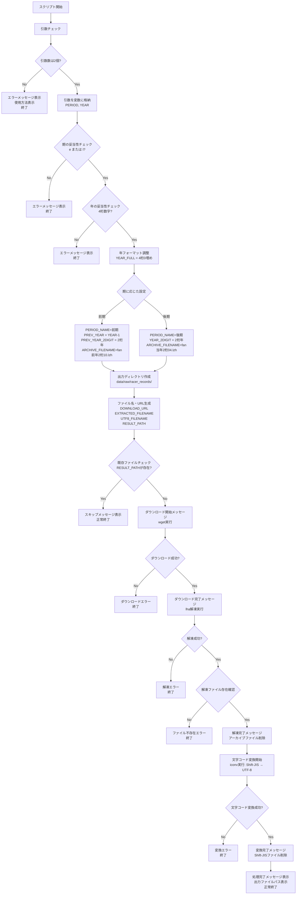

## レーサー期別成績ダウンロードスクリプト仕様書

### 概要
このドキュメントは、レーサー期別成績ダウンロードスクリプトの仕様を記述しています。スクリプトは、指定された期（前期、後期）の成績データをダウンロードします。ダウンロード後、圧縮されたファイルを解凍し、Shift-JISエンコーディングのファイルをUTF-8に変換します。

### 注意
スクリプトは、レース情報のダウンロードスクリプトである`download_race.sh`と同様のスクリプト構造を持たせてください。そのまま流用して必要部分を変更する形で実装します。（これはメンテナンス性をあげるためです）

### 言語
bashスクリプト

### ファイル名
`download_racer_record.sh`

### 実行方法
```bash
./download_racer_record.sh [e|l] YYYY
```
ここで、`YYYY`は年（4桁）、eは前期、lは後期を指定します。

### ダウンロード処理
`wget`コマンドを使用して、指定されたURLからlzh形式の圧縮ファイルをダウンロードします。ダウンロードしたファイルはカレントディレクトリに一時的に保存されます。
指定URLは以下の形式です。
- 前期: `https://www.boatrace.jp/static_extra/pc_static/download/data/kibetsu/fan2410.lzh` (2025年前期の場合は2024年10月までの成績で決まるため)
- 後期: `https://www.boatrace.jp/static_extra/pc_static/download/data/kibetsu/fan2504.lzh` (2025年前期の場合は2025年4月までの成績で決まるため)

### 解凍処理
`lha`コマンドを使用して、ダウンロードしたlzhファイルを解凍します。解凍後、ファイルはカレントディレクトリに一時保存されます。解凍が成功した場合、元のアーカイブファイルは削除されます。

### 文字コード変換
解凍されたファイルはShift-JISエンコーディングで保存されているため、`iconv`コマンドを使用してUTF-8に変換します。変換後のファイルは以下のディレクトリに保存されます。
- 保存ディレクトリ: `data/raw/racer_records/`
- 保存ファイル名: `racer_{YYYY}{e|l}.txt`（eは前期、lは後期を表します）
正常に変換された場合、元のShift-JISファイルは削除されます。

### エラーハンドリング
- 起動時に引数が不足している場合、エラーメッセージを表示して終了します。
- 引数に無効な値が含まれている場合、エラーメッセージを表示して終了します。
- ダウンロードに失敗した場合、エラーメッセージを表示して終了します。
- 解凍に失敗した場合、エラーメッセージを表示して終了します。
- 文字コード変換に失敗した場合、エラーメッセージを表示して終了します。

### スクリプトの処理フロー


### 詳細処理ステップ
1. **初期化処理**
   - エラー処理有効化 (`set -e`)
   - エラー処理関数定義 (`error_exit`)
   - 使用方法表示関数定義 (`show_usage`)

2. **引数検証**
   - 引数数チェック (2個必須)
   - 期パラメータ検証 (e または l)
   - 年パラメータ検証 (4桁数字)

3. **設定処理**
   - 年フォーマット調整 (4桁0埋め)
   - 期に応じたファイル名・URL設定
     - 前期: 前年10月データ (`fan{前年2桁}10.lzh`)
     - 後期: 当年4月データ (`fan{当年2桁}04.lzh`)

4. **ファイル管理**
   - 出力ディレクトリ作成
   - ファイル名・パス生成
   - 既存ファイル存在チェック

5. **ダウンロード処理**
   - wget実行 (プログレス表示付き)
   - ダウンロード結果検証

6. **解凍処理**
   - lha解凍実行
   - 解凍ファイル存在確認
   - アーカイブファイル削除

7. **文字コード変換**
   - iconv実行 (Shift-JIS → UTF-8)
   - 変換結果検証
   - 元ファイル削除

8. **完了処理**
   - 処理完了メッセージ表示
   - 出力ファイルパス表示
